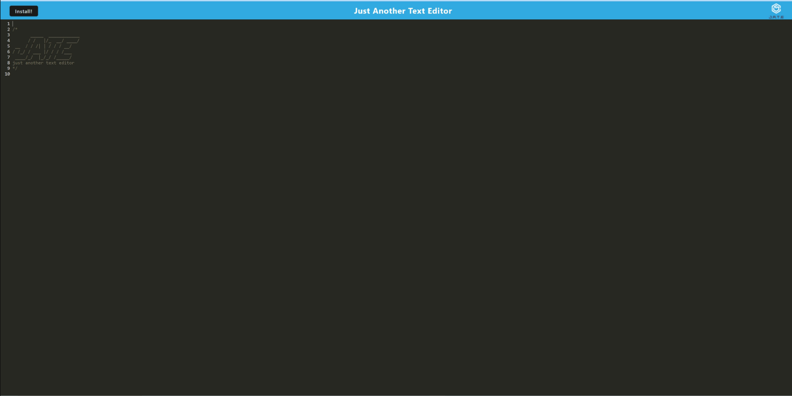

# Text-Editor
The purpose of this assignment was for the creator to practice implimenting PWA for the first time to create a text editor that saves to a database. on the fly text editing that is saved and can be repurposed for later use.

## License
This project is licensed under: 
 
&copy; all rights reserved.

## Luis Alicea
